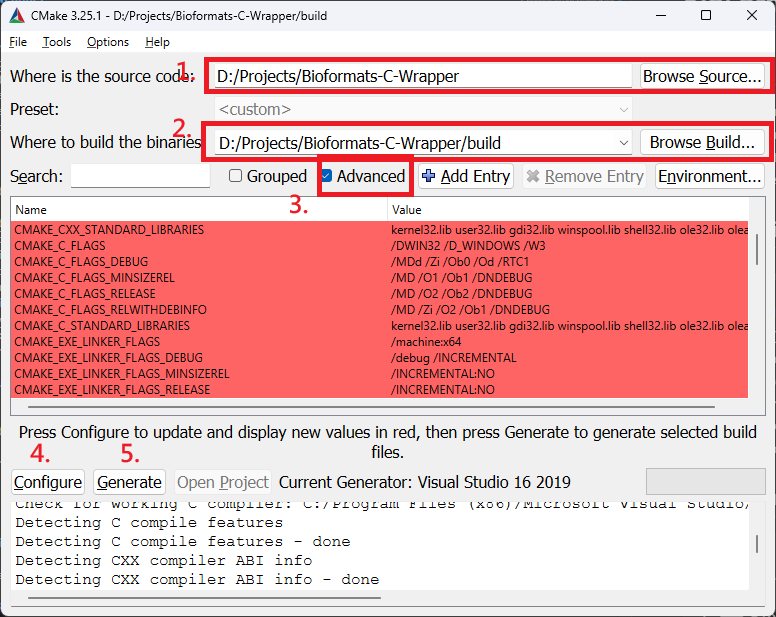

# BioFormats C++ Wrapper
## Overview

**BioFormats C++Wrapper** is a small C++ port that uses the [**Bio-Formats**](https://github.com/ome/bioformats) library to read data from multi-dimensional image files such as **CZI** (Zeiss) and **OME-TIFF**. This wrapper leverages Java and JNI (Java Native Interface) to interact with Bio-Formats, enabling access to metadata such as image dimensions, channels, and timepoints directly from C++ code and keep sync to the development of BioFormats.

## Prerequisites

To build and run this project, you need the following software pre-installed:

- [**OpenJDK**](https://learn.microsoft.com/en-us/java/openjdk/download)

    Recommended Microsoft build with MSI for better MSVC compatibility. Path dependency should be able to automatically resolved by CMake if `$JAVA_HOME` environment variable is set.

    **JNI Headers** should come with the JDK, but ensure they are properly referenced in your environment.
- **CMake** (version 3.10 or later)
- **C++ Compiler**
    - **GCC/Clang**: or another C++ compiler that supports C++17, or
    - **MSVC**: Recommended for Windows users, particularly whom would like to bridge subsequent CUDA libraries.

## Project Structure
```
.
├── CMakeLists.txt 
├── src/ 
│ ├── BioFormatsWrapper.java 
│ └── main.cpp 
└── build/
  └──java
```

## Setup and Compilation

Follow these steps to set up and compile the project:

### 1. Clone the Repository
```bash
git clone git@github.com:Oxford-Zeiss-Centre-of-Excellence/Bioformats-C-Wrapper.git
cd Bioformats-C-Wrapper
```

### 3. CMake Configuration and Build
#### GUI Build
1. Create `build` folder under the project root
2. Start CMake and configure with the following dependency settings:
    
    1. Select The project root
    2. Select the `build` folder created in previous step
    3. Check `Advanced` will display all dependency entries. (Optional for custom path settings)
    4. Run configure 
    5. Run Generate
3. Open the project in MSVC/VSCode and compile.

#### CLI Build
Run the following commands to build the project:

```bash
mkdir build
cd build
cmake ..
make
mkdir build # creates a directory for the build files.
cmake .. # configures the project using CMake.
make # compiles both the Java and C++ components and links them using JNI.
```

## Usage
The application takes a single command-line argument: the file path of the image file you want to read.

```bash
./BioFormatsWrapper_Example /path/to/your/image.czi
```

The program will output metadata about the image, such as its dimensions, number of channels, and timepoints:

```yaml
File: /path/to/your/image.czi
Dimensions: 1024 x 1024 x 5 (Z) x 3 (Channels) x 10 (Timepoints)
```

## Important Notes
1. **Classpath Configuration**: The application uses JNI, so ensure that the classpath is correctly set in src/main.cpp to include the Bio-Formats JAR files and the compiled Java wrapper (bioformats_wrapper.jar).
2. **JNI Header Paths**: Adjust the JNI include paths in CMakeLists.txt based on your operating system and JDK installation.
3. **Image Support**: This application currently supports reading metadata from CZI and OME-TIFF files. Make sure your files are compatible with the Bio-Formats library.

## Troubleshooting
- **Exception 0xC0000005 from JNI_CreateJavaVM (jvm.dll)**: Solution available at https://stackoverflow.com/a/53654317/5237537
<!-- - **Error: Could not find BioFormatsWrapper class**: Ensure that the classpath is correctly set in the C++ code and the JAR file is being generated and linked correctly.
- **Error: JNI not found**: Make sure the JNI headers are correctly included. Update the CMakeLists.txt file to point to your JDK's include and include/linux or include/win32 directories as needed.
- **Java version mismatch**: Ensure that the JVM version you are using matches the JDK used to compile the Java code (e.g., both should be version 8 or later). -->

## License
This project is licensed under the MIT License. See the [LICENSE](./LICENSE) file for more details.

## References
- **Bio-Formats Library**: The Bio-Formats library is developed and maintained by Open Microscopy Environment (OME). Documentations may found [here](https://bio-formats.readthedocs.io/en/v7.3.1/developers/index.html#using-bio-formats-as-a-java-library).
- [**Calling Java from C++ with JNI**](https://www.codeproject.com/Articles/993067/Calling-Java-from-Cplusplus-with-JNI): The Java Native Interface (JNI) is a standard framework that allows C++ code to call Java code, and vice versa.

## Contributions
Contributions are welcome! Feel free to open issues or submit pull requests if you have suggestions for improvements or bug fixes.

## Contact
For questions or support, please contact [ka.ko@kennedy.ox.ac.uk](mailto:ka.ko@kennedy.ox.ac.uk).